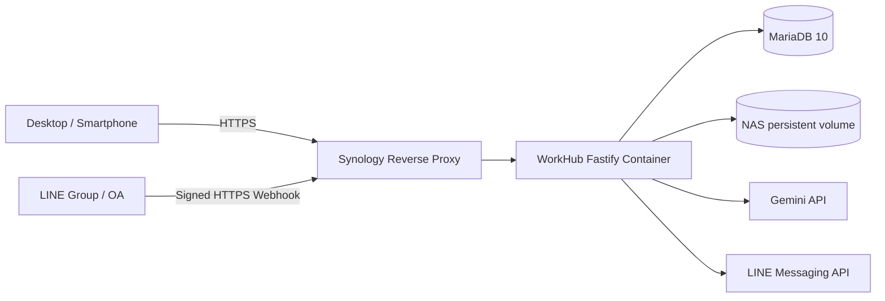

# Architecture

## ขอบเขตระบบ

- `frontend/` และ `dist/`: PWA ที่ให้บริการจาก Container เดียวกับ API
- `server/`: Fastify API, LINE webhook, MariaDB actions, file storage และ export
- `apps-script/`: ระบบ Google รุ่นเดิม เก็บไว้เป็น rollback ไม่ใช่ production ของ NAS
- `tests/`: ตรวจ contract, security boundary, export, image compression และ LINE signature

## Request flow จากเว็บ

1. Browser เข้า HTTPS hostname ของ NAS ผ่าน reverse proxy port 443
2. Fastify ให้บริการ static files และ `/api` แบบ same-origin
3. หน้าเว็บขอ technical session อัตโนมัติ; ค่าใช้จ่ายไม่ถาม PIN ส่วนงานภายในใช้ protected session
4. Mutation ใช้ request ID และ `mutation_log` เพื่อป้องกันคำสั่งซ้ำ
5. MariaDB transaction รักษาความสอดคล้องระหว่าง master, bill, item และ document metadata

## LINE bill flow

1. Fastify ตรวจ `x-line-signature` จาก raw request body ก่อนอ่าน event
2. `line_webhook_events` กัน webhook event ซ้ำแบบถาวร และตอบ HTTP 200 ก่อนงาน OCR
3. รูปถูกดาวน์โหลดจาก LINE บีบอัดเป็น JPEG และเก็บใน `line-inbox` ระหว่างรอรูปหลายหน้า
4. Session แยกตามผู้ส่งและ group/room/user พร้อมรองรับค่าลัด จำนวนหน้า โครงการ และบริษัท
5. เมื่อรูปครบ ระบบส่งไฟล์ที่บีบอัดแล้วให้ Gemini อ่าน บันทึกบิล และ push ผลกลับห้องต้นทาง
6. ผู้ส่งยืนยันหรือยกเลิกบิลจาก postback ได้ รูปชั่วคราวถูกลบหลังสำเร็จหรือยกเลิก

## Security boundaries

- Token, Channel Secret, Gemini key และรหัสฐานข้อมูลอยู่ใน `.env.nas` ที่ไม่ commit เท่านั้น
- Public endpoint เปิดเฉพาะ HTTPS 443; ไม่เปิด MariaDB 3306 หรือ WorkHub 8080 ที่ router
- LINE webhook ใช้ HMAC-SHA256 และ constant-time comparison
- Container ไม่มี Linux capabilities, ใช้ non-root user และ persistent volume จำกัดเฉพาะข้อมูล WorkHub
- รูปบัตรประชาชนใช้ OCR ในอุปกรณ์และไม่ส่งเข้า AI; Gemini ใช้เฉพาะรูปบิล
