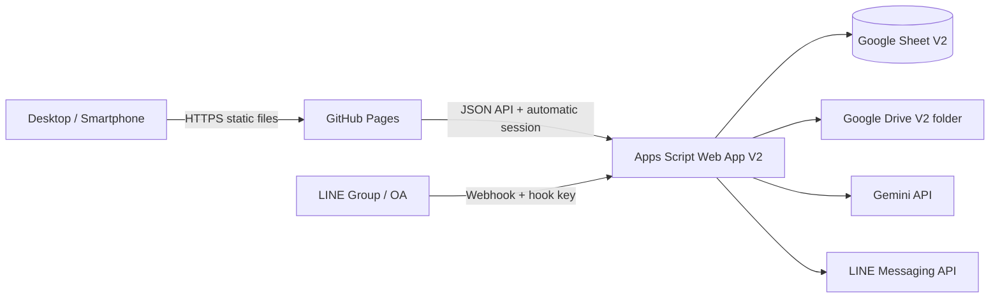

# Architecture

## ขอบเขตระบบ

- `frontend/`: source ของหน้าเว็บเดิมที่แปลงจาก Apps Script HTML Service เป็น static files
- `dist/`: build artifact สำหรับ GitHub Pages; ไม่ commit โดยค่าเริ่มต้น
- `apps-script/`: API, Sheet repository, Drive, Gemini, LINE webhook และ export
- `tests/`: ตรวจ DOM contract กับ V1, action contract, syntax, secret leak และ service worker policy
- `scripts/`: build, local preview, setup, deploy และ status

## Request flow จากเว็บ

1. หน้าเว็บโหลดจาก GitHub CDN
2. `api.js` เรียก Apps Script ด้วย POST `text/plain` เพื่อคง simple CORS request
3. หน้าเว็บขอ opaque technical session ให้อัตโนมัติและเก็บใน `sessionStorage`; ผู้ใช้ไม่ต้องล็อกอินหรือกรอก PIN
4. action ทุกตัวผ่าน allowlist ใน `17_Api.gs`
5. mutation ใช้ request ID คงเดิม, `MutationLog` และ Script Lock เพื่อป้องกันคำสั่งซ้ำ
6. response ทุกตัวใช้ envelope `{ok,data,error,requestId,serverTime,apiVersion}`

## Image flow

### Web upload

`File → decode orientation → resize ≤ 1800 px → JPEG quality loop → target ~1.2 MB → base64 → Apps Script → Drive → Gemini`

บีบอัดพร้อมกันสูงสุด 2 รูปเพื่อลด memory spike บนมือถือ และจำกัด payload รวมหลังบีบอัด 14 MB

### LINE upload

LINE content ต้องถูกเก็บระหว่างรอรูปหลายหน้า ระบบจึงเก็บชั่วคราวก่อน เมื่อ Gemini อ่านครบแล้วจะขอ Drive thumbnail และแทนไฟล์ขนาดใหญ่ถ้า thumbnail มีคุณภาพ/ขนาดเหมาะสม

### DOCX export

อ่านรูปที่จัดเก็บ → ใช้ Drive thumbnail เมื่อรูปเกินเป้าหมาย → คำนวณสัดส่วน → ฝังใน DOCX → zip → บันทึกใน `exports/YYYY-MM` → ดาวน์โหลดแบบ chunk 1 MB

## Performance decisions

- Tailwind compile ตอน build ไม่มี Tailwind CDN runtime
- SweetAlert2/Chart.js self-hosted
- Sheet append หลายแถวด้วย `setValues` ครั้งเดียว
- ค้นหา ID ด้วย `TextFinder`; อัปเดตทั้ง row ครั้งเดียว
- cache master data 5 นาทีและ setup state 6 ชั่วโมง
- upload แสดงสถานะ compression/Gemini โดยไม่บล็อกทั้งหน้า
- long-running submit/export timeout 330 วินาที; action ปกติ 90 วินาที
- PWA ใช้ network-first สำหรับไฟล์ static และ fallback cache เมื่อออฟไลน์ เพื่อไม่ค้างกับ release เก่า

## Security boundaries

- GitHub Pages ถือว่า public client: ไม่มี API key หรือ LINE token
- Secret ทั้งหมดอยู่ใน Apps Script Properties
- ระบบอยู่ในโหมด `OPEN`; ผู้ที่มีลิงก์สามารถเรียกใช้งานได้ จึงไม่ใช่ขอบเขตยืนยันตัวบุคคล
- Technical session อยู่ใน Apps Script Cache และ browser `sessionStorage` เพื่อควบคุมอายุคำขอ, mutation idempotency และ audit เท่านั้น
- Sheet/Drive URL เปิดได้จากหน้าแอปโดยไม่ต้องยืนยัน PIN; สิทธิ์เปิดไฟล์จริงยังเป็นไปตาม Google Drive ของผู้ใช้
- API action ใช้ allowlist ไม่รับชื่อฟังก์ชัน arbitrary จาก client
