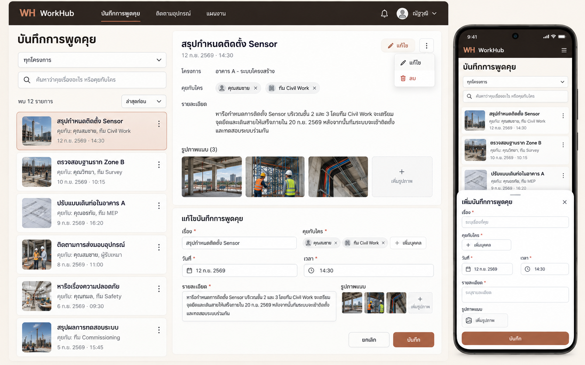
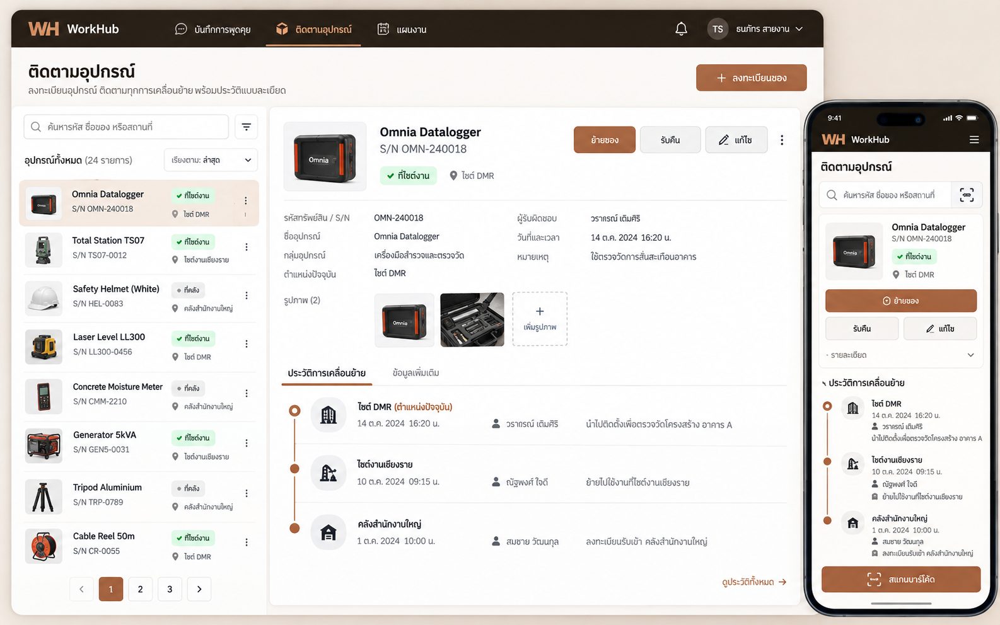
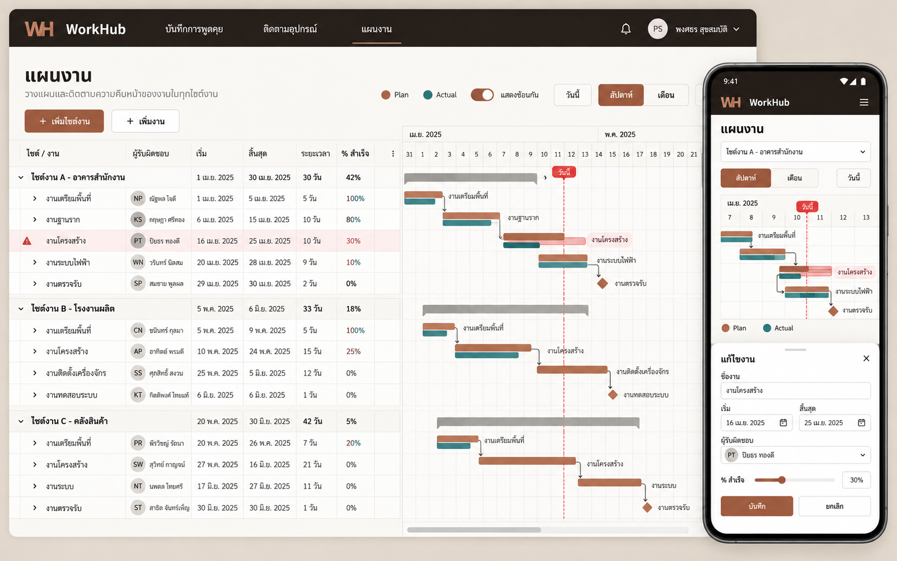

# WorkHub Task Manager — ข้อกำหนดฉบับที่ยืนยันแล้ว

สถานะ: อนุมัติแนวทาง UX/UI แล้ว และยังเป็นงานทดสอบบนเครื่องเท่านั้น

เอกสารนี้เป็นแหล่งอ้างอิงหลักของส่วน Task Manager ตั้งแต่วันที่ 13 กันยายน 2569 เป็นต้นไป ข้อกำหนด แบบทดลอง และโค้ด Task Manager ที่ทำก่อนหน้านี้ **ไม่ให้นำมาใช้ต่อ** การพัฒนารอบใหม่ต้องเริ่มจากขอบเขตในเอกสารนี้และภาพที่อนุมัติด้านล่างเท่านั้น

## ขอบเขตที่ต้องทำ

Task Manager มีเพียง 3 ส่วนหลัก

### 1. บันทึกการพูดคุย

ใช้เป็นสมุดบันทึกที่ค้นย้อนหลังได้ว่า

- คุยเรื่องอะไร
- คุยกับใคร
- คุยวันและเวลาใด
- มีรายละเอียดอะไร
- แนบรูปภาพประกอบได้หลายรูป
- เพิ่ม แก้ไข และลบบันทึกได้
- ค้นหาจากเรื่อง รายละเอียด ชื่อบุคคล หรือวันเวลาได้

หน้าจอต้องเรียบง่าย เน้นการบันทึกและค้นหา ไม่ทำเป็นระบบแชต ไม่เพิ่ม Workflow หรือการอนุมัติที่ไม่ได้ระบุ

### 2. ติดตามอุปกรณ์

ใช้ลงทะเบียนของและตรวจสอบประวัติการเคลื่อนย้ายของแต่ละชิ้น

- ลงทะเบียนด้วยรหัสทรัพย์สินหรือ S/N
- ระบุชื่อและกลุ่มอุปกรณ์
- แสดงตำแหน่งปัจจุบันและผู้รับผิดชอบ
- บันทึกการย้ายและการรับคืน พร้อมวัน เวลา ผู้ดำเนินการ สถานที่ และหมายเหตุ
- เปิดดู Timeline ได้ว่าของเคยอยู่ที่ใดและย้ายไปที่ใดบ้าง
- ค้นหาจากรหัส S/N ชื่ออุปกรณ์ หรือสถานที่ได้
- เพิ่ม แก้ไข และลบกลุ่มอุปกรณ์หรือรายการอุปกรณ์ได้
- ต้องตรวจจับ S/N ซ้ำก่อนบันทึก
- แนบรูปภาพประกอบรายการหรือการเคลื่อนย้ายได้

### 3. แผนงาน

ใช้สร้างและปรับแผนงานในรูปแบบ Timeline/Gantt คล้าย Microsoft Project แต่ทำให้ใช้งานง่ายและเหมาะกับ WorkHub

- เพิ่มไซต์งานและเพิ่มงานย่อยได้
- ระบุผู้รับผิดชอบ วันเริ่ม วันสิ้นสุด ระยะเวลา และเปอร์เซ็นต์ความสำเร็จ
- แสดงรายการงานแบบลำดับชั้นทางซ้าย และ Timeline/Gantt ที่สัมพันธ์กันทางขวา
- ลากงานเพื่อเลื่อนวัน และลากขอบเพื่อปรับระยะเวลาได้
- รองรับความสัมพันธ์ระหว่างงานและ Milestone
- แยก Plan กับ Actual ด้วยสีที่ชัดเจน
- เปิดแสดง Plan/Actual แบบซ้อนกันเพื่อดูความล่าช้าหรือความแตกต่างได้
- เลือกมุมมองวันนี้ รายสัปดาห์ และรายเดือนได้
- มือถือใช้ Timeline ที่เหมาะกับหน้าจอเล็ก ไม่บีบตาราง Desktop ทั้งหมดลงในจอ

## หลักการพัฒนา

- ทำและทดสอบบนเครื่องก่อนเท่านั้น
- ห้าม Push หรือ Deploy ไป NAS จนกว่าจะได้รับคำสั่งยืนยัน
- รองรับทั้ง Desktop และ Smartphone
- ยึดโทนภาพและโครงสร้าง UX/UI จากภาพทั้งสามเป็นหลัก
- ไม่เพิ่มฟังก์ชัน Task Manager จากแนวทางเดิมกลับเข้ามาเอง
- งานรอบใหม่ต้องไม่อ้างอิงการออกแบบ Task Manager รุ่นทดลองก่อนหน้านี้

## เกณฑ์ก่อนนำขึ้น NAS

- เพิ่ม แก้ไข ลบ และค้นหาข้อมูลครบทั้งสามส่วน
- ประวัติอุปกรณ์ไม่สูญหายเมื่อมีการย้ายหลายครั้ง
- การลากและปรับระยะเวลาใน Gantt บันทึกถูกต้อง
- Plan และ Actual แสดงผลถูกต้องทั้ง Desktop และ Smartphone
- ทดสอบข้อมูลคงอยู่หลังปิดและเปิดแอปใหม่
- ผู้ใช้ตรวจรับบนเครื่องและสั่งให้นำขึ้น NAS อย่างชัดเจนแล้ว
